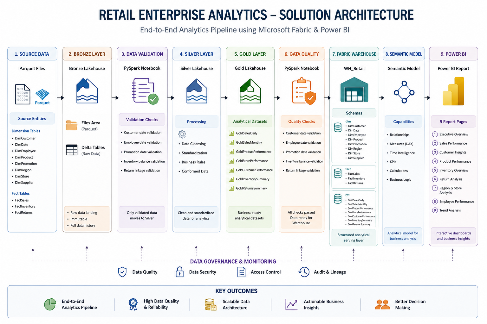

# Retail Enterprise Analytics

An end-to-end **Retail Enterprise Analytics** solution built using **Microsoft Fabric, PySpark, SQL, Power BI, Python, Parquet, and GitHub**.

The project demonstrates a complete analytics workflow from source data ingestion through data validation, Medallion Architecture, data quality, analytical warehousing, semantic modeling, SQL analytics and interactive Power BI reporting.

---

## Project Overview

The solution analyzes retail business operations across:

- Sales
- Customers
- Products
- Inventory
- Returns
- Stores
- Regions
- Employees
- Promotions
- Time-based sales trends

The objective is to transform raw retail data into a structured analytical solution that supports business reporting, performance analysis and decision-making.

---

## Technology Stack

| Technology | Purpose |
|---|---|
| Python | Source data generation and preparation |
| Parquet | Source data storage format |
| Microsoft Fabric | Data engineering and analytics platform |
| Fabric Lakehouse | Bronze, Silver and Gold data layers |
| PySpark Notebooks | Data ingestion, validation and Medallion transformations |
| Fabric Warehouse | Structured analytical serving layer |
| SQL | Analytical queries and reporting |
| Semantic Model | Business relationships, measures and analytical calculations |
| Power BI | Data visualization and business reporting |
| GitHub | Version control and project documentation |

---

## Solution Architecture

The project follows a layered data architecture:

```text
Source Parquet Data
        ↓
Bronze Lakehouse
        ↓
Data Validation
        ↓
Silver Lakehouse
        ↓
Gold Lakehouse
        ↓
Data Quality
        ↓
Fabric Warehouse
        ↓
Semantic Model
        ↓
Power BI
```



---

## Data Pipeline

The data pipeline follows a structured progression from source data to business reporting.

### Source Data

The solution receives source data in Parquet format.

The source entities include:

```text
DimCustomer
DimDate
DimEmployee
DimProduct
DimPromotion
DimRegion
DimStore
DimSupplier

FactSales
FactInventory
FactReturns
```

### Bronze Layer

Raw Parquet files are uploaded to the Bronze Lakehouse Files area.

The Bronze layer provides the initial landing and ingestion layer for the source data.

### Data Validation

The ingested data is validated before downstream transformation.

The implemented validation checks include:

- Customer date validation
- Employee date validation
- Promotion date validation
- Inventory balance validation
- Return linkage validation

### Silver Layer

The Bronze data is cleaned, standardized and transformed into the Silver layer.

### Gold Layer

The Silver data is transformed into business-ready analytical datasets.

The Gold datasets include:

```text
GoldSalesDaily
GoldSalesMonthly
GoldProductPerformance
GoldStorePerformance
GoldCustomerPerformance
GoldInventorySummary
GoldReturnsSummary
```

### Data Quality

A dedicated Data Quality stage validates the processed data before it is published to the Warehouse.

The implemented checks include:

- Customer date validation
- Employee date validation
- Promotion date validation
- Inventory balance validation
- Return linkage validation

All implemented validation checks passed successfully for the validated dataset.

### Warehouse

Validated Gold data is published to the `WH_Retail` Fabric Warehouse.

The Warehouse is organized into three logical schemas:

```text
WH_Retail
│
├── dim
├── fact
└── rpt
```

The `dim` schema contains:

```text
DimCustomer
DimDate
DimEmployee
DimProduct
DimPromotion
DimRegion
DimStore
DimSupplier
```

The `fact` schema contains:

```text
FactSales
FactInventory
FactReturns
```

The `rpt` schema contains the Gold reporting and analytical datasets.

---

## Data Quality

The final Data Quality process validates important business and referential relationships.

| Validation Check | Result |
|---|---:|
| Customer date violations | 0 |
| Employee date violations | 0 |
| Promotion date violations | 0 |
| Inventory balance errors | 0 |
| Return linkage errors | 0 |

### Overall Status

**ALL VALIDATION CHECKS PASSED**

For detailed validation information, see [`DataQuality.md`](docs/DataQuality.md).

---

## Sales Terminology

The project uses the following business definitions consistently across the Warehouse, Semantic Model, SQL analytics and Power BI reports:

| Term | Definition |
|---|---|
| Total Revenue | Gross Sales |
| Revenue | Gross Sales |
| Gross Sales | Sales value before discounts |
| Sales | Net Sales |
| Net Sales | Sales value after discounts |

Therefore:

```text
Gross Sales / Total Revenue
            ↓
     Less: Discount
            ↓
    Net Sales / Sales
```

**Total Revenue and Net Sales are not the same metric.**

For detailed business definitions and calculation rules, see [`BusinessRules.md`](docs/BusinessRules.md).

---

## SQL Analytics

The Fabric Warehouse includes SQL analytics covering:

- Customer and product dimensions
- Sales transactions
- Total customers
- Total products
- Total stores
- Total transactions
- Total revenue
- Total quantity sold
- Average order value
- Sales by year and month
- Sales by category
- Top products
- Top customers
- Sales by region
- Sales by store
- Customer analysis
- Product analysis
- Ranking analysis
- Running totals
- Year-over-year analysis
- CTE-based analysis
- Sales summary view

The SQL analytics scripts are available in the [`sql`](sql) folder.

---

## Power BI Report

The final Power BI solution contains **9 analytical pages**:

1. **Executive Overview** — Overall business performance
2. **Sales Performance** — Sales performance and trends
3. **Customer Insights** — Customer behavior, value and retention analysis
4. **Product Performance** — Product, category and brand performance
5. **Inventory Overview** — Inventory levels, stock value and movement
6. **Return Analysis** — Return trends, reasons and return performance
7. **Region & Store Analysis** — Regional and store performance
8. **Employee Performance** — Employee and workforce performance
9. **Trend Analysis** — Time-based trends, growth and moving averages

Power BI report screenshots are available in [`images/powerbi`](images/powerbi).

---

## Key Analytical Areas

The solution provides insights into:

- Gross Sales / Total Revenue
- Net Sales / Sales
- Sales growth and trends
- Customer value and segmentation
- Customer retention
- Product and category performance
- Inventory levels and inventory value
- Return patterns and reasons
- Regional and store performance
- Employee performance
- Promotion impact
- Time-series analysis
- Moving-average analysis
- Year-over-year performance

---

## Repository Structure

```text
Retail-Enterprise-Analytics/
│
├── docs/
│   ├── Architecture.md
│   ├── BusinessRules.md
│   ├── DataDictionary.md
│   ├── DataFlow.md
│   ├── DataQuality.md
│   ├── ProjectOverview.md
│   └── Warehouse.md
│
├── images/
│   ├── architecture/
│   ├── fabric/
│   ├── powerbi/
│   └── warehouse/
│
├── notebooks/
│   └── Fabric data engineering notebooks
│
├── sql/
│   └── SQL analytics scripts
│
└── README.md
```

---

## Documentation

Additional project documentation is available in the [`docs`](docs) folder:

- [`Architecture.md`](docs/Architecture.md) — Solution architecture and data platform design
- [`BusinessRules.md`](docs/BusinessRules.md) — Business definitions and calculation rules
- [`DataDictionary.md`](docs/DataDictionary.md) — Tables and field definitions
- [`DataFlow.md`](docs/DataFlow.md) — End-to-end data pipeline and transformation flow
- [`DataQuality.md`](docs/DataQuality.md) — Data quality and validation approach
- [`ProjectOverview.md`](docs/ProjectOverview.md) — Detailed project overview
- [`Warehouse.md`](docs/Warehouse.md) — Warehouse structure and analytical serving layer

---

## Project Objective

The project demonstrates how a retail organization can build an end-to-end analytics platform using Microsoft Fabric and Power BI.

It combines:

```text
Data Engineering
       ↓
Data Validation
       ↓
Medallion Architecture
       ↓
Data Quality
       ↓
Data Warehousing
       ↓
SQL Analytics
       ↓
Semantic Modeling
       ↓
Business Intelligence
```

The solution transforms source retail data into structured analytical datasets and delivers actionable business insights through Power BI.

---

## Key Capabilities Demonstrated

The project demonstrates practical experience with:

- Microsoft Fabric
- Fabric Lakehouse
- Medallion Architecture
- PySpark data processing
- Data ingestion
- Data validation
- Data quality
- Fabric Warehouse
- SQL analytics
- Dimensional data modeling
- Semantic models
- DAX measures
- Time intelligence
- Year-over-year analysis
- Moving-average analysis
- KPI development
- Power BI reporting
- Data visualization
- GitHub project organization
- Technical documentation

---

## Author

**Pravash Paul**

**Microsoft Certified: Power BI Data Analyst**

### Skills Demonstrated

- Microsoft Fabric
- Power BI
- SQL
- Python
- PySpark
- Data Cleaning
- Data Validation
- Data Modeling
- Data Visualization
- Data Analytics
- GitHub
